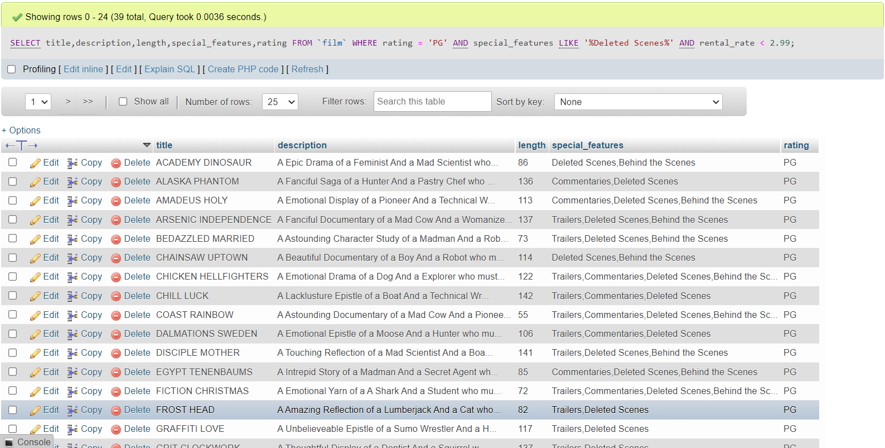
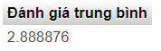
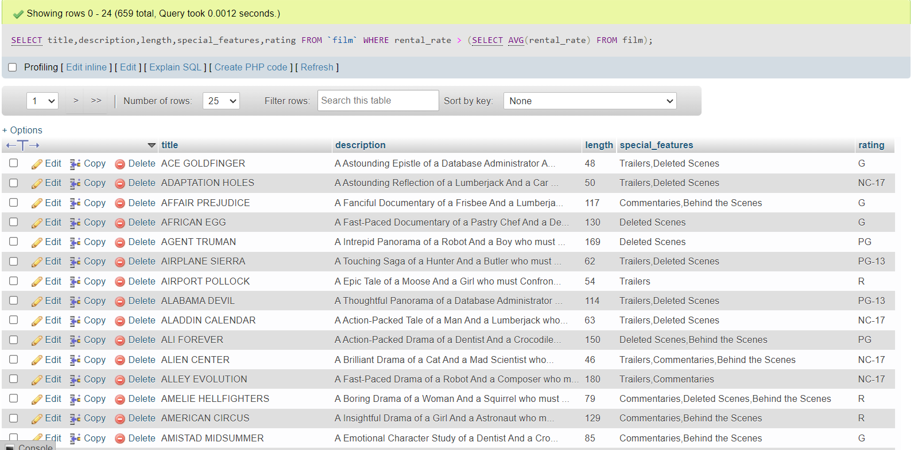
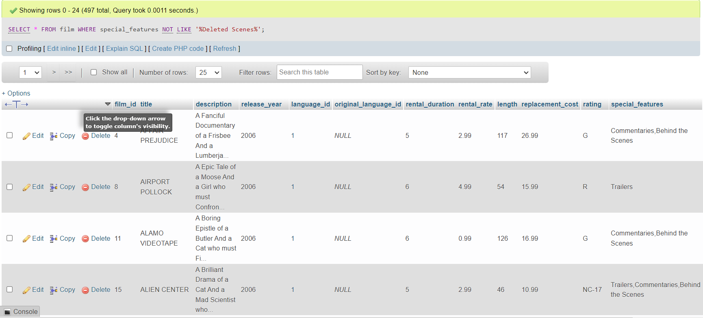

## _1.Lấy ra thông tin các bộ phim gồm: Tiêu đề, mô tả, thời lượng, special feature, rating. Có rating là PG, special feature là Deleted Scenes, rental_rate nhỏ hơn 2.99_

```sql
SELECT title,description,length,special_features,rating
FROM `film`
WHERE rating = 'PG' AND
special_features LIKE '%Deleted Scenes%' AND
rental_rate < 2.99
```



## _2, Lấy ra thông tin các bộ phim gồm: Tiêu đề, mô tả, thời lượng, special feature, rating._

_Lấy ra trung bình cộng của rental rate có rating là G._

```sql
SELECT AVG(rental_rate) AS 'Đánh giá trung bình'
FROM film
WHERE rating = 'G'
```



_Lấy ra các bộ phim có rental rate > trung bính cộng vừa tính_

```sql
SELECT title,description,length,special_features,rating
FROM `film`
WHERE rental_rate > (SELECT AVG(rental_rate) FROM film)
```



## _3, Lấy ra các phim có special feature khác Deleted Scenes_

```sql
SELECT *
FROM film
WHERE special_features NOT LIKE '%Deleted Scenes%'
```


